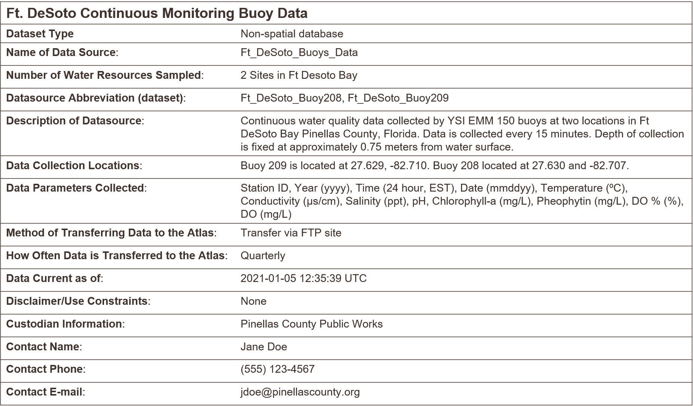
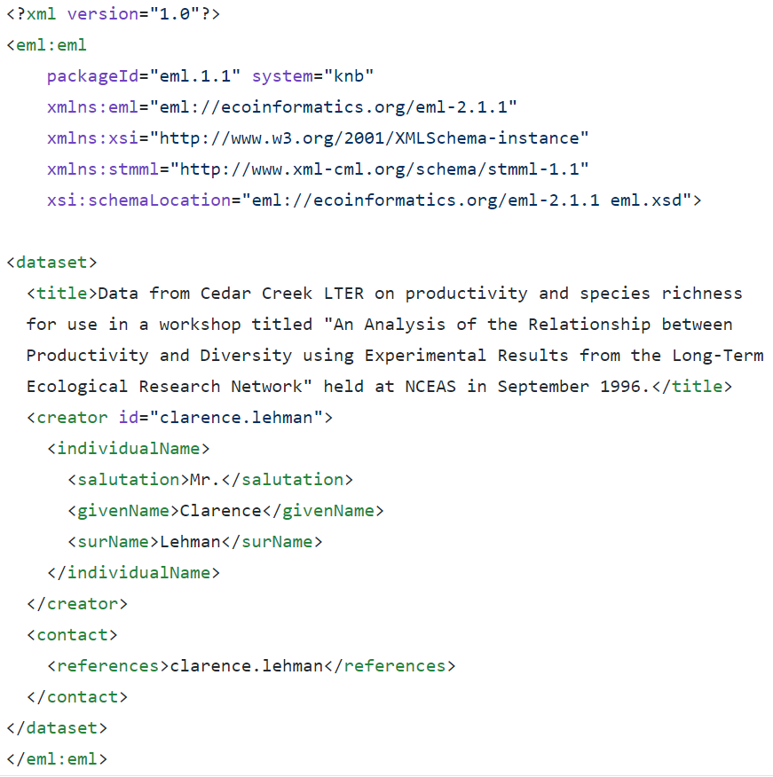
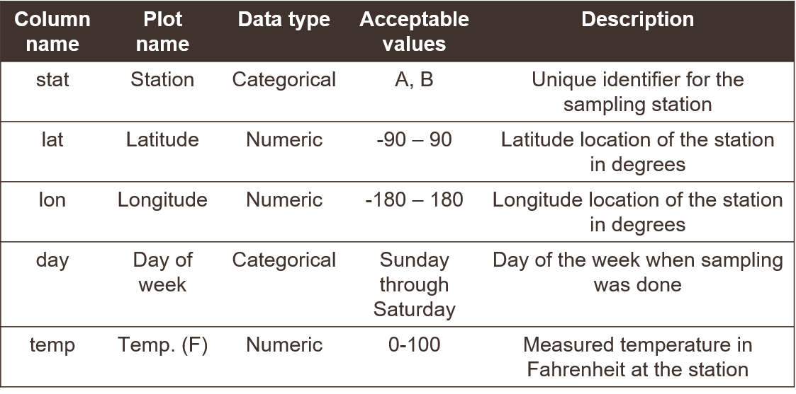
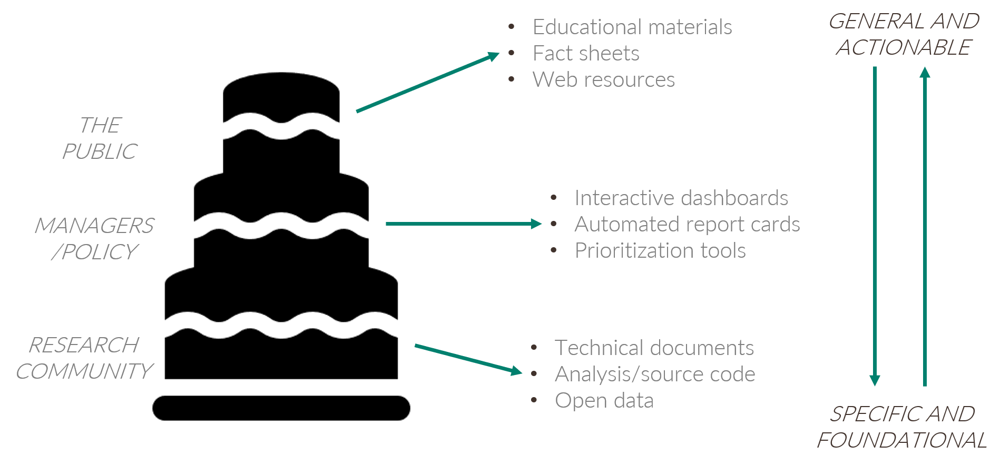
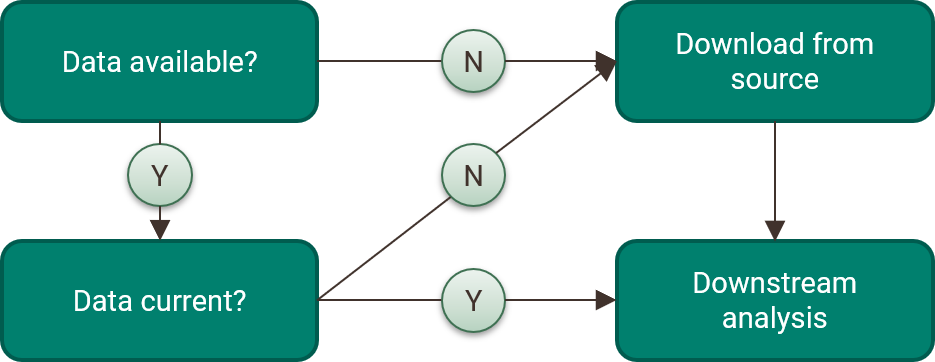
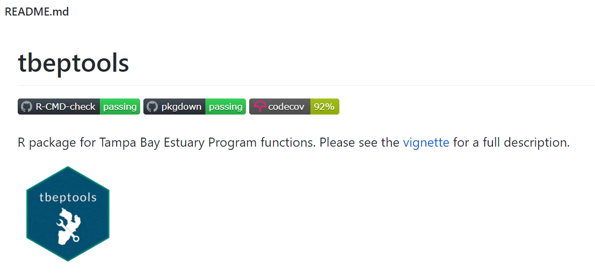
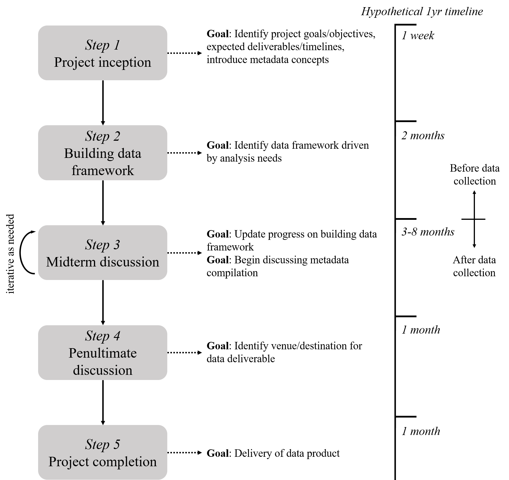

```{r setup, echo = F, warning = F, message = F, results = 'hide'}
# figure path, chunk options
knitr::opts_chunk$set(fig.path = 'figs/', warning = F, message = F, echo = F, cache = F, dev.args = list(family = 'serif'), dpi = 300, warning = F,
  fig.process = function(x) {
  x2 = sub('-\\d+([.][a-z]+)$', '\\1', x)
  if (file.rename(x, x2)) x2 else x
  })

# # extract bib entries from online
# bib_scrp('manu_draft.Rmd', 'refs.bib')
```

`r paste('Last manuscript build', Sys.time())`

```{r echo = F, cache = F, eval = F}
spelling::spell_check_files('manu_draft.Rmd')
```

# Abstract

Consensus on managing environmental resources is difficult to achieve without free exchange of ideas between the research community, resource management professionals, policy-makers, and the broader public. Within the research community, printed periodicals continue to be used to share and validate research results.  An expectation is that these products and the data behind them can be used outside of academic circles for actionable outcomes that support environmental decision-making.  In the absence of methods to effectively share ideas and data supporting a research product, this mode of thinking often leads to implied science where the naive hope is that the research paper alone is sufficient to affect change.  In order to achieve truly applied science, researchers, managers, and the institutions that support them can leverage open science practices for better data management.  Data serve as the foundation of all research products and can be products in themselves that deserve a life beyond a research project.  The National Estuary Program within the United States is one such example where data management practices can be improved to better achieve science-based management plans for estuaries of national significance.  This paper describes an approach leveraged by the Tampa Bay Estuary Program to adopt open science tools for better data management, both internally to increase efficiency and among regional partners that can affect positive environmental change.  The ideas are equally applicable to other institutions that struggle with data management in settings where research products are intended to have actionable outcomes. A data management workflow is presented that can be adopted at any stage of the research process using FAIR principles and internet resources for curating data.  A pragmatic approach is emphasized that encourages others to work towards incremental improvements over time by applying modular tools in a generalizable framework. By recognizing the important role of data in the research process and how data can ultimately shape informed decisions, this paper advocates for better data management practices as a critical step in science application.

*Key words*: data, FAIR, metadata, National Estuary Program, open science

# Introduction {#background}

Data are critical to making informed policies and decisions about how we manage behaviors and actions that affect the environment.  As a fundamental part of the scientific method, data provide the raw information to support hypotheses that inform our understanding of natural processes.  Data are the foundation for environmental research which develops this understanding and ultimately support informed decisions for managing natural resources by the TBEP. As methods for managing environmental resources continue to evolve, so does our understanding of data and its potential applications.

When we discuss "data" we often describe a very general term that has different meanings for different people.  In its simplest form, data can be tabular information for the results of an experimental analysis or field survey.  For environmental managers, data can mean the long-term record of routinely collected and updated monitoring information used to assess status and trends of a natural resource.  Even further, data can be highly aggregated and novel products created through complex meta-analyses of independent datasets.  In all cases, the need to describe a dataset's purpose and origin, and identify its permanent and long-term home are critical to ensure forward progress in both conventional research and how research informs environmental management. 

There are many reasons why data may not be effectively managed, chief among which is that it can be tedious and unglamorous work that is often an afterthought.  However, investing time upfront to manage a dataset can have long term benefits, although these values may not be obvious or realized in the short-term.  Lack of effective data management often results in "orphaned" datasets and data products which have lost critical reference documentation. A classic graphic in Michener et al. [@Michener97] demonstrates how knowledge of a data product can be lost over time. As a research team publishes a paper, the information content of the data and metadata is at an all-time high because the ideas and concepts have been intensely studied and evaluated in the months leading up to publication.  After publication, researchers move on to other projects or responsibilities, and specific details about the initial project are lost rapidly as attention is focused elsewhere.  At longer time scales, other factors can contribute to the erosion of information content, including career changes through retirement or staff turnover or accidental loss of information (laptop takes a bath, lab fires, etc.). 

The final step in Figure \@ref(fig:michener) leading to absolute and complete loss of information on a data product is death of an investigator. Although a bit morbid, this is a very real and preventable problem in the process of discovery that can lead you down the frustrating path of reconstructing a data product's origin by scouring historical records that have little to no descriptive information. As a remedy, many research teams have adopted the "bus factor" term as motivation to prevent this problem. The bus factor is an informal measurement of the relative risk associated with loss of information if an investigator was to, hypothetically, be hit by a bus (alternatively, the "lottery factor" describes departure of an individual if they were to win the lottery).  Datasets or workflows that have a high bus/lottery factor are at high risk of being orphaned with the  departure of a team member.    

The costs of not effectively managing your data can vary, but each is a byproduct of neglecting an investment in data curation.  In fact, you can probably recall several past instances when poor data management has come back to haunt you.  Here are a few real-world examples: 

1) A collaborator calls you on the phone asking about a historical dataset from an old report.  You spend several hours tracking down this information because you don't know where it is. The data you eventually find and provide to your collaborator has no documentation and they don't know how to use it or use it inappropriately. 
1) You receive a deliverable from a project partner that was stipulated in a scope of work.  This deliverable comes in multiple formats with no reproducible workflow to recreate the datasets.  You are unable to verify the information, eroding your faith in the final product and making it impossible to update the results in the future.
1) An annual reporting product requires using new data each year.  The staff member in charge of this report spends several days gathering the new data and combining it with the historical data.  Other projects are on hold until this report is updated.  Stakeholders that use this report to make decisions do not trust or misunderstand the product because the steps for its creation are opaque. 

A more general problem with poor data management is stifled creativity.  The use of other people's data and services [i.e., "OPEDAS"; @Mons18] to generate novel research or data products is increasingly common, particularly in the last several decades with the advance of internet communications.  Entire disciplines and new analytical methods have been developed around this idea [e.g., meta-analysis; @Carpenter09; @Lortie14].  The generation of new data with an incomplete history or that lack metadata documentation is a disservice to both the researcher that created the data and the larger scientific community that could benefit from further advancing this information.  As a result, scientific progress will not continue as rapidly as it could if data products are discoverable and openly available. 

Poor data management can also lead to peculiar or entrenched workflows that are not scalable or translatable for other users.  Data managers often have their own preferences for processes that simply "work for us", either because they were learned out of necessity because the work had to be done or it has been done a certain way for so long that it now seems normal, despite being inefficient or prone to error.  In extreme cases, this can lead to workflows that may seem legitimate on the surface but are problematic because they lack a common formality or standard.

@Mons18 describes "professorware" as a workflow to handle or generate data that addresses a novel intellectual challenge, which is important in research or discovery, but is not scalable or sustainable in the long run.  Think of a pet project where you've written some code to achieve a certain task.  It might be clunky, but you're proud of it because it gets the job done on your computer and saves you from having to do a task by hand.  These workflows often masquerade as novel "software packages" that do great things, which they can and often do, but they lack support because they're not developed using community standards or best practices for long-term use or scalability.  This is especially problematic when these workflows are intentionally or unintentionally embedded into larger data management systems.  If one piece of the system lacks provenance or support, it puts the larger data management system at risk.  

Role of research and resource management agencies in facilitating applied science...

How can open science help...

## Open Science {#opengeneral}

The open science approach provides a philosophy and set of tools to help address the costs of poor data management.  Before we proceed, we need to make a distinction between the broader concept of open science and open data as one component of the former.  Many of the guidelines and examples in this SOP fall broadly under the open science umbrella (or cake as you'll see in section \@ref(philo)), but it's important to understand how data management includes a set of tools that are part of, but not exhaustive of, the entire open science toolbox.  Conversely, many broadly applicable open science tools that can be applied to other management scenarios can also benefit data management. 

An example may be helpful.  Metadata, a key component of data management, leads to more open sharing. When we talk about metadata, the assumption is that its creation is to promote sharing and transparency for open data. However, while metadata can be created in an open environment and is often created for the purpose of facilitating openness, it can also be created completely in isolation with a closed workflow, resulting in a significant potential for loss of important information.

On the other hand, broader open science principles that support a culture of sharing can also have value for research workflows that generally have nothing to do with data.  For example, the "public school of thought" for open science focuses on making science more accessible to the general public, e.g., through citizen science initiatives or science blogging [@Fecher14].  Although this approach doesn't deal explicitly with best practices for data management, this mentality certainly has benefit for creating a culture that appreciates and learns from science, which logically leads to discussions on the importance of data.  

For these reasons, this document covers many topics that may fall squarely under the realm of data management, while at other times advocating for more general open science principles with the intent of supporting a culture of better data management. 

## The TBEP philosophy {#philogeneral}

The Tampa Bay Estuary Program ([TBEP](https://www.tbep.org)) is one of [28 National Estuary Programs](http://nationalestuaries.org/) designated by Congress to restore and protect "estuaries of national significance." Many of these estuaries are heavily urban (i.e., having economic, recreational, cultural importance) and have had historical or ongoing issues contributing to poor environmental quality.  The recovery of Tampa Bay is an exceptional story of an urban estuary that demonstrates the value of the NEP approach to restoring and protecting environmental resources. Through a coordinated regional effort of environmental professionals, utility operators, community members, and local politicians, nutrient loads to the bay have been reduced by ~2⁄3 from 1970s levels and seagrasses surpassed the 1950s benchmark extent in 2014 [@Greening14;@Sherwood17]. Even more remarkable is that while the human population in the Tampa Bay watershed continues to increase, nutrient loads into the Bay remain low. 

The TBEP is a key facilitator among the many local partners that have an interest in the region's natural resources. Our facilitation is guided by several documents, including an [Interlocal Agreement](https://drive.google.com/file/d/1iJcWxmc5SeyDTqiCQ3MLQGWEY_EDGtZT/view?usp=sharing) with our partners, a [Comprehensive Conservation and Management Plan](https://indd.adobe.com/view/cf7b3c48-d2b2-4713-921c-c2a0d4466632), and a [Strategic Plan](https://drive.google.com/file/d/11xohuoaHDxNHRqgXoOHdI37FpWvac_rn/view?usp=sharing).  In simple terms, these documents respectively describe *who* we work with, *what* we need to accomplish, and *how* it can be accomplished.  

Open science and data management have everything to do with how we facilitate bay management.  Our recent update to the Strategic Plan specifically speaks to our use of open science as: 1) a general direction for how we accomplish our work to achieve the desired future state of Tampa Bay, and 2) a unique value proposition that TBEP offers within its sphere of influence.  We articulate the use of open science at TBEP as a cornerstone strategy: 

> Be the primary source of trusted, unbiased, and actionable science for the Tampa Bay estuary, recognizing that open science principles will serve the Program’s core values.

As a Program with a small staff, successful protection of Tampa Bay's natural resources depends on the work of our many partners.  While we use open science principles internally, we can have a much greater impact if our partners understand the value of open science and actively work towards adopting its principles in their own workflows.  We are actively supporting our partners through this journey through an Open Science Subcommittee that has a goal of developing a community of practice that works and learns together to navigate the open science landscape.  The Subcommittee's [roles and responsibilities](https://docs.google.com/document/d/1w6dVTwfYYDRVzGPXy0jyHxV4mwOutEY_ISMP1oAdZ_c/edit) document explains how we are accomplishing this goal.

Our Program rests on a strong foundation of [research](https://tbep.org/our-work/library/) that guides decision-making for Tampa Bay covering three decades of science and collaboration.  Although great strides have been made, we intend to continue building on those accomplishments as an organization, including enhanced data management practices guided by open science principles.  The details of this approach and why we've adopted an open science ethos are explained more fully in section \@ref(philo). 

## Goals and objectives of this document

This Data Management Standard Operating Procedure (SOP) describes TBEP's approach to address data management needs for the long-term restoration and protection of natural resources in Tampa Bay and its watershed.  We are inclusive of multiple definitions of data from simple spreadsheets to more complicated workflows that generate reporting products to support environmental decisions. This broad net is designed to account for both the variety of data we use as a Program and the diversity of partner agencies we depend on to achieve our science-based mission.  The management of environmental resources combines a healthy mix of conventional science with consensus driven decisions, often with strong regulatory overtones.  A robust approach for working with data that promotes trust and validity in the environmental decision and ensures that science continues to progress without reinventing the wheel is foundational for these processes.

The goal of this paper is motivate researchers and resource management professionals to become stewards of their data by demonstrating the value of open data practices and providing a road map to achieving this goal. Each section of the paper addresses a critical topic or provides a roadmap that can be used to collectively work towards achieving this goal.  We first provie an overview of general and specific topics that useful to understand as core data management management tenets. Second, we describe the TBEP approach to managing data as a suite of tools and then provide a roadmap to further developing data management workflows.  We conclude with some guidance to help continue the path of adopting open science principles in personal and institutional workflows. 

Identifying what this SOP is and what it is not can help set expectations for the use of this document.  As noted above, the TBEP is a relatively small organization that interfaces directly or indirectly on many projects supported or managed primarily by our partners.  Because of the diversity of projects relevant to our work, it would be inappropriate and impossible to describe a detailed step-by-step SOP that could apply to every project that has relevance to the TBEP's mission.  Therefore, the approaches and workflows we describe are meant to be generalized to many project types.  Any specificity that is described relates to how to use tools that have broad applicability, e.g., developing a GitHub workflow or describing general characteristics of metadata that could apply to many data types.  This distinguishes this SOP from others that may apply rigorous standards to one particular problem.

To summarize, this document __is__: 

* An explanation of the TBEP approach to data management, including our philosophy and the existing tools we have developed; and,
* A generalized cookbook describing how to manage datasets in an open science framework, including considerations before, during, and after a project.

This document __is not__:

* A definitive overview of best practices for data management -- there are other resources that cover these topics in more detail; and,
* A comprehensive list of available online services for opening data, although we certainly lean towards specific platforms that we find useful.

This paper is written for the research community and for technical staff at resource management organizations, although the concepts and principles are appropriate for some tasks conducted by managers or higher administrative staff.  These individuals are also in a position to foster better practices for data management by creating space and time for technical staff to adopt these new workflows.  Understanding the importance of the tools is important, but sufficient space must be available for these skillsets to grow through a shared community of practice.  Over time, the return on investment in staff developing these skillsets will be realized.   

# Key Concepts and Principles {#keys}

## The FAIR principles {#fair}

For every important data contribution, community standards or best practices for that dataset or product should be used to ensure the intended audience can find, access, use, and replicate the data.  The FAIR principles [@Wilkinson16] provide some general guidelines to follow for ensuring the openness of a data product.  The FAIR acronym is described as follows:

* **F**indable: The data have a globally unique and persistent identifier, including use of "rich" metadata.
* **A**ccessible: Once found, the data can be retrieved using standardized communications protocols that are open, free, and universally implementable.
* **I**nteroperable: The ability of data or tools from non-cooperating resources to integrate or work together with minimal effort.
* **R**eusable: If the above are achieved, the data and metadata are described in a way that they can be replicated and/or combined in different settings.  

Simply, what this means is: 1) each dataset has a name that doesn't change and can be found with minimal effort using that name, 2) once it's found, you can actually get your hands on it (e.g., not behind a paywall), 3) once you have it, you can use readily available tools to work with the data (e.g., not using proprietary software), and 4) you can actually apply the data for your own needs because it has sufficient context, including its reproduction, given the the first three principles are met.  

In practice, the FAIR principles invoke several concepts that will be described in more detail later, but a gentle introduction follows.  The term "globally unique and persistent identifier" (under **F**) is a mouthful that simply means the dataset has a name assigned to itself that is not assigned to any other dataset (globally unique) and it's permanent (persistent).  This doesn't mean a descriptive or literal name, such as you would assign to a file on your own computer, rather it means a computer-generated identifier created using a known standard.  One such example is a [DOI](https://www.doi.org/), or digital object identifier.  These are commonly assigned to publications as a static web address (unique and persistent) and are increasingly being used as identifiers for datasets.  

Findable and accessible also imply the data have a home with an address.  The latter describes the unique identifier, whereas the home itself is a permanent location conferring accessibility.  There are several options for where data can live long-term and theoretically forever, so long as the internet exists.  There are literally thousands of repositories online that can be used for archiving data and the answer to which repository you should use is also almost always going to be "it depends".  We provide some examples in section \@ref(moregit).

The FAIR principles are not rigorous standards, rather they establish general questions you should ask of a dataset to make sure you've done your due diligence in working towards openness.  Further, because they are not rigorously defined, different organizations may interpret the principles differently, and it is important to realize that your understanding of the principles may differ from others.  For example, individuals may define "reusable" in different ways that can affect the level of detail provided in the metadata. These principles are presented here as a reminder to think about them often, especially during the beginning of a project, and how they can be applied in opening the most important contribution of your project. 

## The importance of tidy data {#whytidy}

We introduced different data products in section \@ref(contribs), ranging from tabular data to more abstract definitions that may include analysis pipelines or online services.  Tabular data are by far the most recognized and most common data type and it's worth covering a few basic principles for managing these data that will help you tremendously in the long run.  At their core, tabular data are a simple conceptual model for storing information as observations in rows and variables in columns, yet its very common to try to make a data table more than it should be.  Unless you spend a lot of time working with data, it can be difficult to recognize common mistakes that lead to "table abuse".  

Before we get into tidy data, we need to discuss some of the downfalls of Excel as a data management system. There are [many examples](http://www.eusprig.org/horror-stories.htm) that demonstrate how Excel has contributed to costly mistakes through the abuse of tables, often to the detriment of science [@Ziemann16]. Although it is a very interesting and clever program, it is not software developed for data storage.  It is a graphical user interface masquerading as data management and analysis software. It includes many tools that may appear useful for organizing information, but that ultimately increases risk and make your life as an analyst more difficult.  

Excel allows you to abuse your data in many ways, such as adding color to cells, embedding formulas, and automatically formatting cell types (figure \@ref(fig:excelbad)).  The problem occurs when this organization becomes ambiguous and only has meaning inside the head of the person who created the spreadsheet.  For example, color may be used to fill cells of a given category. This may seem harmless, but in doing so, you've not only indirectly created more data, but you've created data that have an ambiguous meaning.  Embedding formulas that reference specific locations in or across spreadsheets is also a nightmare scenario for reproducibility.  There is no clear way to extract the hidden workflow embedded in many spreadsheets.

If you absolutely must use Excel to store data, the only acceptable format you should use as a responsible data steward is a rectangular, flat file.  We mean "rectangular" as storing data only in rows and columns in matrix format (e.g., 10 rows x 5 columns), with no "dangling" cells that have values outside of the grid or more than one table in a spreadsheet.  We mean "flat file" as no cell formatting, no embedded formulas, no multiple spreadsheets in the same file, and data entered only as alphanumeric characters. This will ensure that there is no ambiguous information and a machine will have no problem reading your spreadsheet.  Your data will be pure and simple and not abused. @Broman18 provide an excellent guide that expands on these ideas. Essentially, these best practices force you to isolate the analysis from the data - many people use Excel to mix the two, leading to problems. 

Now we can introduce some additional principles for tabular data that will improve how they are used in downstream analysis pipelines.  The "tidy" data principles developed by Hadley Wickham [@Wickham14c] are a set of simple rules for storing tabular data that have motivated the development of the wildly popular tidyverse suite of R packages [@Wickham19]. If you're already using the rectangular, flat file format, adopting the tidy principles should be a breeze. The rules are simple: 

1. Each variable must have its own column;
1. Each observation must have its own row; and,
1. Each value must have its own cell.

Graphically, these rules are shown in figure \@ref(fig:tidy). 

Using these principles for data storage may seem unnatural at first because of a difference between what's easy for entering data versus what makes sense for downstream analyses.  The former is what leads to abuse of tables.  For example, dates are often spread across multiple columns, such as having one column for each year of data where the header indicates the year that applies to data in each column.  This convention may be used because it's easy to add another year of data as an additional column when more data each year are collected.  However, this is untidy because the date variable occurs across columns.  If you wanted to evaluate changes across years in a formal analysis, you'd have to reorganize these data in a tidy format.  

Using a tidy format also allows you to more easily merge or join data between tables.  This is a common task when analyzing data where you have information spread between different tables because: 1) it might not make sense to keep the data in the same table, and 2) the analysis depends on information from both tables.  For example, perhaps you want to evaluate how a measured variable at different locations changes across space.  You might have one table that includes station metadata (e.g., site name, location) and another table that includes field observations (e.g., site name, collection date, field data) (Figure \@ref(fig:joins)).  Keeping the station metadata in a tidy format in one table makes sense because these data will not change.  Keeping field data in another table would also make sense because you collect information at each location at different times.  Including station coordinate information in the same table as the field data would create extra information because you need a value for location for every row you have field data.  This is redundant and unnecessary.  

If you're using a tidy format, it's simple to join two tables for analysis.  This requires identifying a linking variable or "key" that is a common identifier between tables.  In the above example, this would be the site name (Figure \@ref(fig:joins)).  Other situations may require identifying more complex keys depending on your analysis question.  Our question above relates to evaluating station differences by location, so the site name is a logical choice for a key.  For all cases, a key is used to resolve a uniquely identifiable value that can be used to link observations. If the important data contribution of your project includes multiple tables, you'll need to identify appropriate keys that allow you to clearly link observations between tables.  

## Metadata {#metadatadesc}

Just as "data" can have different meanings to different people, "metadata" is a loosely defined term that describes one of the most important aspects of data management.  Metadata varies from simple text descriptions of a dataset, such as "who", "what", "when", "where", "why", and "how", to more formalized standards with the intent of preparing your data for archival in a long-term repository.  Having no metadata is almost a guarantee that your dataset will be orphaned or misused by others, either inadvertently or with willful acknowledgment that the original purpose of the data is unknown and its use may be inappropriate for the task at hand.  Metadata are also important for enabling discovery of your data (the __"F"__ in FAIR).  So, when you think of data management, you should think of it as synonymous with metadata curation. 

Metadata is literally defined as "data about data" or "information about information".  A more comprehensive definition is provided by @Gilliland16:  

> A suite of industry or disciplinary standards as well as additional internal and external documentation and other data necessary for the identification, representation, interoperability, technical management, performance, and use of data contained in an information system.

We use this definition as a starting point to develop our thinking around best practices for metadata generation and curation.  Again, it's good to emphasize that some metadata is much better than no metadata at all.  Just because you are not using industry or disciplinary standards for generating metadata doesn't mean you're approach is incorrect.  As you get comfortable with the general purpose of metadata and how it's developed as a description for a dataset, you can build on this knowledge by working towards more formalized metadata standards.   

At its basic level, think of metadata as a simple text file containing the information about your dataset. This text file provides answers to common questions about the origin of your data so that anyone (or a computer) with zero knowledge about your data can quickly orient themselves as to what the data represents and its purpose.  The US Geological Survey provides a useful document on creating [Metadata in "plain language"](https://prd-wret.s3.us-west-2.amazonaws.com/assets/palladium/production/atoms/files/Metadata%20in%20Plain%20Language_508compliant.pdf) to distill the basic information contained in a metadata file.  As indicated above, it provides a workflow for answering the "who", "what", "when", "where", "why", and "how" questions for metadata.  We provide a brief synopsis of these questions below. You can apply this workflow to generate your own metadata.

> What does the dataset describe?

Information here would include very basic details about the dataset including a **title**, **geographic extent**, and **period of time** covered by the data.  For geographic extent, this may often include explicit coordinates covering the study area, i.e., the lower left and upper right of a bounding box.  Location is useful for indexing your dataset relative to others, if for example, a researcher wanted to find data for all studies in the geographic extent of Tampa Bay. Other useful information about the "what" might include the type of data, e.g., tabular, map, online dashboard, etc. 

> Who produced the dataset? 

This would be yourself and anyone else who has made a significant contribution to the development of a dataset.  People may have differing opinions regarding what defines a "significant" contribution, but as the curator of a dataset, it's up to you to determine how important it is for inclusion of each individual as a potential contributor.  Data are increasingly being used as citable resources and including individuals that were important in its generation ensures proper attribution.  For scientific publications, each author is generally expected to have made substantial contributions to the study conception and design, data acquisition or analysis, or interpretation of results.  The same would apply to data.  If someone has spent hours toiling in the field to collect the data or hours visually scanning a spreadsheet for quality control, include them!

> Why was the dataset created? 

Describing why a dataset was created is critically important for developing context.  If others want to use your data, they need to know if it's appropriate for their needs.  Here you would describe the goal or objectives of the research for which the data were collected.  It should be clear if there are limitations in your data defined by your goals.  For example, you may have collected field data in a particular time of year to address questions about seasonal changes.  Using these data to answer broader temporal questions, such as inter-annual changes, would be inappropriate and could lead to invalid conclusions if someone using your data were not aware of this limitation.  Identifying the "why" of your dataset could also prevent misinterpretation or misuse of the data by non-specialists.  Think of it as an insurance policy for your data.

> How was the dataset created? 

Here you would describe the methods used to generate the data, e.g., field sampling techniques, laboratory methods, etc.  This information is important so others can know if you've used proper and accepted methods for generating the data.  Citing existing SOPs or methods that are recognized standards in your field would be appropriate.  If you are generating a synthesis data product using data from external sources, make sure to document where those data come from and the methods you used for synthesis.  Pay attention to documenting the software that was used, including the version numbers.  If you have analysis code or script that was used for synthesis, provide a link if possible.   

> How reliable are the data? 

It's also very important to document aspects of a dataset that affect reliability.  The answers you provide to the above questions can provide context to this reliability, but it's also important to explicitly note instances when the data could be questionable or inappropriate to use.  Here you could describe any quality assurance or quality control (QAQC) checks that were used on the data.  There are often formalized ways to do so, such as codes or descriptors in tabular data defining QAQC values (e.g., data in range, below detection limits, sensor out of service, etc.).  You will want to clearly describe what each of these codes mean and if they cover the range of conditions possible for your data.  Other QAQC procedures, such as how the data were verified for accuracy, can also be described.   

> How can someone get a copy of the dataset?

Good metadata has information on who has the data and how to contact them for requesting access.  This contact may not be the same as who created the dataset (e.g., IT staff).  For archived or publicly available data, this information is more important for who to contact should someone have questions.  Information on obtaining a copy of the data should also describe any special software or licensing issues related to accessing the data.  Under the **I** in FAIR, you should strive to make your data as interoperable as possible and not store your data in an obscure format that requires specialized software.  If this is unavoidable (e.g., your data are large and it needs to be compressed), describe what needs to be done to access the data.  Any licensing or permissions issues on using data should also be described, e.g., is it free for use with or without attribution, are there limitations on its use, etc. The [licensing chapter](https://r-pkgs.org/license.html) in @Wickham15 is a great resource to learn more about these issues.  Although this chapter relates to code licensing, the same principles could apply to data.

### Metadata examples {#metadata}

Now that we've covered the general concepts of what is included in metadata, we provide some examples of what this looks like in practice.  At it's simplest, metadata can be a text file that includes information on the questions above. Below is one such example of metadata that accompanies a dataset for a local project we're working on.  

Just by looking at the metadata, we can quickly understand some basic information about this dataset. It describes some water quality monitoring data at two buoys near Ft. DeSoto in Pinellas County, Florida.  We can see the type of data, how often it's collected, what equipment was used, the location of the buoys, some contact information should there be questions, and other items that provide additional context.  Although it doesn't cover all of the questions above, an analyst has some assurances to confidently work with these data since the metadata provides basic context.  

The example in figure \@ref(fig:desotometa) represents the bare minimum of what should be done to document metadata. This metadata is an excellent example of the principle that __some metadata is better than no metadata__. Many datasets lack even the simplest information to facilitate their use by others. At its core, metadata should serve the purpose of providing information about information.  No matter the level of specificity or metadata standard that was used, all metadata serve this need.  However, more formalized approaches to documenting metadata can play an important role in preparing a dataset for discovery by others and long-term archiving. The next section provides one example of a metadata standard that TBEP encourages for most environmental datasets.   

### The EML standard {#eml}

There are countless standards for metadata that go beyond the simple descriptive text shown above. These standards provide a formalized approach or "schema" to documenting metadata that provides context about a dataset that is also machine readable.  The latter component is critical for making sure that all datasets prepared for hosting or archiving in a data repository follow the same standards for documenting metadata.  The core pieces of information (who, what, when, where, why, and how) are included, but in a formalized way to allow for rapid searching and queries when the data are stored along with hundreds to thousands of other datasets. 

One such standard that is useful for environmental data is the [Ecological Metadata Language](https://eml.ecoinformatics.org/) or EML.  The EML standard defines a comprehensive vocabulary and a readable XML markup syntax (fancy talk for machine readable) for documenting research data.  Importantly, the standard is community maintained and developed for environmental researchers who want to openly share their data.  The EML standard is also used by the [Knowledge Network for Biocomplexity](https://knb.ecoinformatics.org/) or KNB, which is an online repository that is federated with a much larger network of online data repositories. 

The EML metadata file is an XML file that looks something like this: 

The file in figure \@ref(fig:emlsimple) might look complicated, but it's just a way to document the basic components of metadata so that a machine can read them.  Regarding the descriptive role of metadata, the above example provides a title for the dataset, a brief description, and who to contact.  All the rest is additional information about the standard that was used and basic XML tags to identify parts of the document. The EML provides many more standards to document other types of metadata information for the questions in section \@ref(metadatadesc).  

A specific reason why EML is mentioned here is the availability of additional software tools to help create EML files for your data.  In particular, the [EML](https://docs.ropensci.org/EML/) R package provides these tools to streamline metadata creation.  Nobody wants to type an XML file by hand, so the EML packages provides a set of functions where a user can input basic metadata information to create the XML file automatically.  All you need is a basic understanding of R and the purpose of metadata to use the EML package for your own needs. More information can be found on the website: https://docs.ropensci.org/EML/

Of course, you can always manually enter your metadata when you submit a dataset to an online repository. Most repositories, KNB included, provide a form entry system for doing so. An EML file is automatically generated after the metadata have been entered. This may not be the most efficient choice, but is often the preferred for first-timers that may not yet be comfortable using other tools to generate metadata.

### Data dictionaries {#dict}

A final note about metadata relates to data dictionaries and what they mean for describing a dataset. A data dictionary is an informal tool for conceptualizing components of a dataset.  It is not usually included with metadata, but its development can inform metadata documentation. This can be incredibly useful for understanding context of a dataset, which is why we include a short description here in the metadata section.  However, data dictionaries also have importance for more general best practices for data management. A data dictionary can describe column names and the type of data in each column (Figure \@ref(fig:datadict)).  Simple things like how you name a data column can have larger implications for downstream analysis pipelines or interpretability of a dataset.

Here we provide some general guidelines for developing your own data dictionary.  This is all information that can be included in metadata, but it is also useful to consider for data management.  

> Column names

Be as descriptive as possible while trying to keep the name as short as possible. Really long names with lots of detail can be just as frustrating as very short names with very little detail.  Ideally, the description of data in a column can be included in metadata, but the column name should also be intuitive to point the analyst in the right direction.  Try to avoid spaces in column names since some software may interpret that as the start of a new column.  It may also be useful to identify a "plot name" for each column name [@Broman18] that uses proper spelling and punctuation.  Using a column name directly in a graphic is generally a bad idea since their meaning outside of the dataset may not be obvious.   

> Column types

Describe the type of data in each column, e.g., numerical measurements, categorical descriptors, or counts of observations.  Never, ever mix data types in the same column.  If your data are continuous numeric values, try to identify an acceptable range for the values, e.g., are there minimum or maximum values that would indicate the data are out of range? Also make note of the units that were used.  For categorical descriptors, identify all possible categories that are acceptable values for the column, e.g., small, medium, or large for a qualitative descriptor of size.  For dates, make note of the format, e.g., YYYY-MM-DD.  For time, identify the timezone. 

## Where do data live? {#datahome}

Identifying a location for where your data can be stored long-term is an important step in working towards FAIR principles.  Hosting your data in an online repository makes your data findable and accessible by others and also ensures that your data are of sufficient quality to adhere to standards for the repository.  There is a staggering variety of online repositories, many of which are domain-specific, and it can be difficult to find the best repository that is suitable to your needs.  

As with metadata, the same rule applies to online data storage - something is better than nothing.  Making your data available in a location that can be accessed by others, including metadata, is much, much better than not sharing your data at all, even if that location is not an "official" data repository.  For this purpose, online FTP/HTTP websites can be sufficient.  Of course, the major drawback of not hosting your data in an official repository is that others can't easily find the data.  You can of course send the link to anyone that's interested, but this means they need to know the data exist to request the link in the first place. A useful scenario is that you include the location of the data as a supplemental link in a published paper or technical report. This takes advantage of existing and known communication avenues in the research or management community (e.g., a scientific journal) as a means to guide someone to your data.

Hosting data on [GitHub](https://github.com/) is another simple solution to making your data available to a larger community.  GitHub is neither a federated repository, nor is it setup specifically for long-term data storage.  However, if you already use GitHub and you want to do something rather than nothing at all, GitHub can be a useful solution to begin opening your data.  GitHub was initially setup as an online platform for software or code version control, so it doesn't have all the hallmarks of a conventional data repository.  GitHub also does not work well with large datasets (e.g., more than 100 Mb).  However, it can work well for smaller datasets and offers other amenities that can help you work towards the FAIR principles. For example, the URLs where your data are located are stable (in the sense that they don't change), a DOI can be attached to your data (e.g., through [Zenodo](https://zenodo.org/)), the data are publicly accessible if you choose to make them so, and you can include any appropriate supplemental information (i.e., metadata files). GitHub can be especially useful if your data product is a workflow that includes code to create a tool for environmental decision-making.

A better, but more involved, solution for opening data is using a federated data repository. These are networks of distributed nodes (online access points) or individual repositories that collectively use similar standards in archiving data.  They address the problem of multiple disconnected archival systems that are difficult to navigate.  For example, the [KNB](https://knb.ecoinformatics.org/) repository is one node of the larger [DataONE](https://www.dataone.org/) federated network.  DataONE includes other repositories that are domain-, industry-, or regionally-specific that collectively fall under a more generic category of environmental or earth sciences data.  All nodes in the larger DataONE network can be easily navigated and have full infrastructure support from DataONE. 

The main advantage of hosting your data in a federated repository is that it will truly be discoverable - it can be found online through standard search queries.  No prior knowledge is needed about the data for someone to find the information.  For example, perhaps someone is interested in finding datasets within a specific geographic location.  They can search the federated network with these criteria and your dataset will be returned if it's within the boundaries.  Your metadata includes that information as a queryable attribute.  Another advantage is that your data should live on in perpetuity, so long as the internet exists.  As mentioned above, GitHub can be a location to store data for open access; however, there is no guarantee that GitHub will always be available as an online service. Federated repositories take great measures to ensure the long-term viability of their resources, including multiple distributed backups in different locations and interoperability of datasets across platforms.  You receive those benefits as a guarantee when your data are hosted on these services. 

# Data Management Workflow {#workflow}

This section is in two parts, to first describe a workflow that we use internally at TBEP to manage our data in section \@ref(tbepapproach) and then to describe a road map for opening internal or external datasets at your own organization in section \@ref(howyou).  The first section expands on our philosophy for using open science to manage data, including specific workflows we use, as context to the second section.  Our approach is one way of applying open science to managing data.  Applying the same approach at your organization may or may not be appropriate depending on your internal and external needs for managing data.  As such, our approach is generalizable and modular - any of the approaches can be modified in part or together for your own needs. 

## The TBEP approach {#tbepapproach}

### An Open Science philosophy {#philo}

Sections \@ref(opengeneral) and \@ref(philogeneral) introduced you to our basic philosophy and approach to managing data at TBEP.  As an organization that facilitates science, management, and outreach activities among our local partners, we adopt open science as a cornerstore strategy that will serve the Program's core values.  This approach is made explicit in our [Strategic Plan](https://drive.google.com/file/d/11xohuoaHDxNHRqgXoOHdI37FpWvac_rn/view?usp=sharing) that describes how we achieve programmatic goals defined under our [Comprehensive Conservation and Management Plan (CCMP)](https://ccmp.tbep.org) and the partner commitments identified in our [Interlocal Agreement](https://drive.google.com/file/d/1iJcWxmc5SeyDTqiCQ3MLQGWEY_EDGtZT/view?usp=sharing) to help us achieve our goals. 

Our data [Quality Management Plan](https://drive.google.com/file/d/1DyA0PNHV8rEXGMwGiyS7sXY1ECLYpJJO/view) (QMP, @tbep1620) is a companion document to this SOP that ensures the data used by TBEP for decision-making has known and documented quality and is being used appropriately. The QMP establishes an internal process for verifying data quality standards that conform with the federal requirements our organization is subject to, as funded in part by federal dollars under Section 320 of the [Clean Water Act](https://www.epa.gov/laws-regulations/summary-clean-water-act).  Conversely, this SOP is a more hands-on and accessible document that describes a how-to approach for data management that we adopt as an organization.  The SOP goes beyond the QMP by exposing the process and ideas behind how we manage data at TBEP so that others can learn from our experience.  We encourage you to also view our QMP to understand the literal benchmark we use to ensure quality of our data.

We actively work to apply open science to every activity we pursue to achieve our goals under the CCMP.  Open science is a philosophy and set of tools to make research reproducible and transparent, in addition to having long-term value through effective data preservation, provenance and sharing [@Beck20].  We use a definition from the [Creative Commons](https://creativecommons.org/about/program-areas/open-science/) for open science as:

> Practicing science in such a way that others can collaborate and contribute, where research data, lab notes and other research processes are freely available, under terms that enable reuse, redistribution and reproduction of the research and its underlying data and methods.

There are several key words we can extract from the definition - collaborate, contribute, reuse, redistribute, and reproduce.  These concepts channel some of the ideas described by the FAIR principles (section \@ref(fair)).  We can further elaborate on these key words by defining open science as a set of four core principles (Dan Gezelter, <http://openscience.org/what-exactly-is-open-science/>. 

1. Transparency in experimental methods, observations, and collection of data.
1. Public availability and reusability of scientific data.
1. Public accessibility and transparency of scientific communication. 
1. The use of web-based tools to facilitate scientific collaboration and reproducibility.

Why is this so important?  Environmental science is very much in the business of applied science, meaning that research that is conducted to develop an understanding of the environment can be used to support the protection and management of a resource.  We need to understand a problem before we can  pursue actions that effectively adress it, especially if a wrong decision or action is costly.  Active and useful channels of communication must exist for the lessons learned from science to be applied to real world problems.  Applied science can be facilitated with open science to create these channels, and therby accelerate practical solutions. 

Without getting too much into the history of how insular practices among academics have contributed to closed science, it's useful to briefly discuss some of reasons why science may not be translated into action.  As a generalization, researchers are trained to study and document details.  Progress in science is based on: 1) an intimate understanding of details that guide process, and 2) convincing your peers through rigorous review that you actually understand the details you claim to understand.  As a result, we catalog progress in ways that are true to the scientific process, often as dense texts with every last detail noted.  Many researchers not being taught otherwise will often assume that this is an effective way to communicate scientific results to non-scientists.  What we don't realize is that those that need this information to make decisions do not communicate this way because they are not in the business of scientific discovery. Unless they have a personal interest, they don't care about the science behind the decision, only that the science is right to justify the decision.  The most ineffective approach for a scientist to inform environmental management is to deliver a dense 500 page report and assume it provides an effective vehicle for an environmental manager to make a rational decision.  This is not applied science - it is "implied science" because we implicitly decide that our conventional modes of scientific communication will influence management or policy. 

In addition to communication barriers, other challenges to applied science include irreproducible results, information loss, inaccessible data, and opaque workflows (section \@ref(whymanage), Figure \@ref(fig:divide)).  These challenges affect how science is delivered to decision-makers, how much trust a decision-maker can have in the science behind the decision, and how likely the science can be used as a springboard for additional scientific inquiry.  Effective data management as a subset of the broader principles of open science can help bridge the "research-management divide" and help develop continuity of scientific products that can benefit the larger research community.    

### The open science cake

Truly applied science facilitated by open science principles allows for research results or data to connect with different audiences along a spectrum.  It allows research to be shared with other researchers, be connected with decision-makers, and be accessible to the general public.  Where an individual consumes scientific information along the spectrum depends on their interest, need, or level of background knowledge about a subject.  A solid technical foundation is a prerequisite for sharing information and open science methods allow various elements of the research foundation to be accessible to different end users.  We meet our audience where they're at, rather than assuming they can find their way to the details they need. 

We can describe this metaphor as the __open science cake__ (figure \@ref(fig:cake)).  We use this metaphor because everybody loves cake and it conveniently describes the TBEP philosophy to delivering science in an applied context.  This delicious layered cake is a gradient of information from top to bottom.  At the top, the information is more general (e.g., educational material for public consumption) or can be used to inform action (e.g., what needs to be done to remedy a problem).  At the bottom, the information has specificity and forms the foundation for generality or action at the upper layers.  The bottom of the cake is large, reflecting the decades of research and technical resources that are available to inform the management of Tampa Bay (e.g., our [library](http://tbep.org/library)).  The bottom also includes resources that can be used to springboard additional research, such as analysis code and source datasets.  Individuals at the top of the cake probably don't want a slice at the bottom, but the slice they take from the top would not exist without support from the bottom.

Most of our partners are professionals from resource management or local government agencies that have some vested interest in the protection and restoration of Tampa Bay.  This is the primary audience that we can inform for decision-making.  Broadly speaking, this is the audience that needs distilled information from research products but with a level of specificity that goes beyond educational materials.  These individuals are in the middle of the cake and the slices they take are actionable science products, such as interactive dashboards, automated report cards, and other decision support tools.  The middle part of the cake is where conventional science becomes truly applied science.

The cake also emphasizes a vertical connection among the layers that allows an individual to take a slice as high or as low in the cake as they want.  This is a critical principle of open science that speaks to accessibility of information at all levels of the scientific process.  Most of the time, an individual will take a slice from the cake at the level that's appropriate for their needs.  However, we want our science (and data) to be transparent and accessible under the FAIR principles and someone can take a slice at a different level, if they have a need to do so.  This also speaks to developing a community of practice for open science - we develop this community to provide easier access to the tools at the bottom of the cake and develop the ability to use them to reproduce or expand on existing products at all levels.  

Our web products on the [data visualization](https://tbep.org/our-work/data-vizualization/) section of our web page are designed to guide an individual to the slices they need at the different levels of the cake.  The website is setup as a series of cards (cakes) for each reporting product that act as an entryway (top of the cake) to the middle and bottom layers of each cake.  For exmple, if someone clicks on the [Water Quality Report Card](https://tbep.org/water-quality-report-card/), they are directed to a web page that has very general information about the reporting product and links to a [summary pdf](https://drive.google.com/file/d/124FXmLcXKYUf3ktaVOvFejndiPS0m7K7/view?usp=sharing) that distills over forty years of water quality data for the Bay.  There are links on the right side of the page that provide access to the building blocks of the report card, including the online dashboard, source code for the report card, build status of the report (more on this in section \@ref(automation)), citable DOI, and technical documents that describe the science behind our water quality assessment approach.  These links provide the path to the lower levels of the cake.    

### How do we build the cake? {#automation}

The cake is a useful metaphor to describe how we apply open science to achieve applied science, but how is this done in practice?  How are the layers of the cake actually linked to one another?  We use several open source programming tools to link source data to reporting products, with the goal of producing the most timely information for decision-makers with minimal overhead by internal staff.  In this section, we describe these tools and how we link them together to create a workflow that is both automated and reproducible.

The workflow we use to link source data to reporting products for our [annual water quality assessment](https://tbep.org/water-quality-report-card/) is shown in figure \@ref(fig:osworkflow). The process begins by accessing an external data source from our partners.  In this case, this workflow accesses a spreadsheet of water quality data on an [FTP site](ftp://ftp.epchc.org/EPC_ERM_FTP/WQM_Reports/) maintained by the Environmental Protection Commission of Hillsborough County (EPC).  These data are processed using custom-built software developed by TBEP staff and with a suite of more general open source tools, including R, RStudio, relevant data wrangling packages, and tools for document preparation.  The open source tools we've created are also hosted online on [GitHub](https://github.com/tbep-tech) which serves two goals.  First, providing the tools on GitHub makes them discoverable and accessible to others. Second, they are integrated into an automated process to make sure the most current data are used for reporting. Once the build process for the report card is done, the final products are shared as a Shiny web application for additional inquiry and discovery, and our two-page PDF report are hosted on the TBEP website for general dissemination.

The core component of this entire workflow is the [tbeptools R package](https://tbep-tech.github.io/tbeptools/) [@Beck21].  This software was developed using the [R programming language](https://cran.r-project.org/) to read, analyze, and visualize data that we use to report on progress in achieving CCMP goals.  Most of the data tools on our web page depend on functions within the tbeptools package to work with the raw data provided from our partners. Although tbeptools is primarily used by TBEP staff, the package is provided free of use (under the [MIT license](https://tldrlegal.com/license/mit-license)) for anyone interested in exploring the data on their own.  Importantly, all source code is available on GitHub so that anyone with an interest can understand exactly what is done to process the data we use for reporting.  This is a very literal definition of method transparency.  

There are several functions in the tbeptools package that are built specifically for reporting on water quality, all of which are explained in detail in the [introduction vignette](https://tbep-tech.github.io/tbeptools/articles/intro.html) for the tbeptools package. A "vignette" in the R world is a plain language document that explains how to use functions in a package.  Currently, the tbeptools package includes five vignettes, one for each indicator that has reporting functions available in the package:

* [Intro to TBEP tools](https://tbep-tech.github.io/tbeptools/articles/intro.html): A general overview of the package with specific examples of functions for working with the water quality report card.
* [Tampa Bay Nekton Index](https://tbep-tech.github.io/tbeptools/articles/tbni.html): An overview of functions to import, analyze, and plot results for the Tampa Bay Nekton Index.
* [Tampa Bay Benthic Index](https://tbep-tech.github.io/tbeptools/articles/tbbi.html): An overview of functions to import, analyze, and plot results for the Tampa Bay Benthic Index.
* [Tidal Creeks Assessment](https://tbep-tech.github.io/tbeptools/articles/tidalcreeks.html): An overview of functions to import, analyze, and plot results for the assessment of tidal creeks in southwest Florida.
* [Seagrass Transect Data](https://tbep-tech.github.io/tbeptools/articles/seagrasstransect.html): An overview of functions to import, analyze, and plot results for the seagrass transect data collected in Tampa Bay.

Each vignette is set up similarly by explaining the functions used to read, analyze, and visualize the data.  In fact, every function name in the package is named with an appropriate prefix for what it does, e.g., `read_transect()` reads seagrass transect data, `anlz_transectave()` analyzes annual averages of seagrass frequency occurrence, and `show_transect()` shows a plot of the transect data.  The examples in the vignette further explain how to use the functions and what each function does when working with the data.  

The functions in tbeptools used to read data into R were all built to ensure the most recent data are used for analysis.  Each data import function follows a decision tree shown in figure \@ref(fig:readchk), where a set of internal checks are used to see if the data are available on your computer, compare the data to the online source, and download the most recent version if a local file doesn't exist or your current file is out of date.  This process also ensures that any downstream reporting products are using the most current data.  For example, the web page for [water quality assessment](https://tbep.org/water-quality-report-card/) has a provisional report card that is based on the most recent water quality data available from EPC.  Although the "official" report card is published at the beginning of each year, provisional data throughout the year can be used to assess water quality changes in near real time.

The workflows we've created that access source data to create reporting products depend on data being online in a stable location.  This underlies the importance of proper data management practices.  We cannot create and use the reporting products without a findable and accessible location for the source data.  The data we use for our various indicators are distributed at different locations depending on who maintains the information.  This includes a mix of FTP sites, Microsoft Access databases, JSON files, or geospatial data hosted through third party websites.  The various locations, data formats, and depths of available metadata are a potential concern for long-term viability of these workflows.  A majority of the locations where these data are found are not formal data archives or repositories and there are not any "official" standards for how these data are made available.  Because of this, a long-term goal for TBEP and our partners is to work towards a shared data management infrastructure that more closely follows the FAIR principles.

A critical part of the workflow in figure \@ref(fig:osworkflow) is automation.  We have developed the functions in the tbeptools package with this in mind, i.e., making sure the most up to date data are used without having to manually download the data.  We also leverage continuous integration/continuous deployment (CI/CD) services through GitHub that automate our workflows.  CI/CD simply means that we've setup automated checks and processes based on different triggers that happen when we do something to a project that we've put on GitHub.  For example, every time we push (upload) a change that we've made on a local version (i.e., on a personal computer) of tbeptools to the main repository on GitHub, a set of automated checks are used to make sure we didn't break anything in the package.  The "badges" you see on GitHub and in the data visualization section of the TBEP website indicate if the checks were successful or not.  These badges are small indicator icons that are shown as green (checks passing), red (checks failing), or grey (no information).  They are often included in GitHub repositories and can also be linked on other websites.  These provide a quick scan of whether or not you should expect the package to work as intended if you download it from its current state in the repository.   

Many of the README files for the different GitHub projects we maintain include one or more badges that indicate if our data products are working as we hope.  For example, the README file for our tbeptools R package includes three badges that indicate the status of different CI/CD processes (figure \@ref(fig:badges)).  The first badge, R-CMD-Check, shows if the set of standard checks for R packages are passing.  There are dozens of checks for R packages, including things like making sure the documentation is up-to-date, file sizes aren't excessive, the file structure is setup correctly, the examples run without errors, etc. (see [chapter 19](https://r-pkgs.org/r-cmd-check.html) in @Wickham15 for a full description of these checks).  The second "pkgdown" badge shows if the [website](https://tbep-tech.github.io/tbeptools/) for the package (built with the R pkgdown package; @Wickham20) has been successfully built with the last change to the repository, i.e., does information on the website reflect the package in its current state?  Finally, the "codecov" badge provides a general estimate of how much code in the package includes unit tests as part of best practices for software development. In this case, nearly all of the code (92\%) is tested in one form or another.

The CI/CD workflows are completely customizable to suit the needs of a given project. The badges in the previous example simply indicate if the CI/CD checks for a package and its website are working correctly.  These are often included in README files to give users peace of mind that our development processes are following accepted standards in the broader open source community.  Other badges can indicate if a custom workflow is up to date, such as for our automated reporting products.  The water quality report card has a provisional draft that uses the most recent dataset from EPC.  The CI/CD process is setup to rebuild the pdf by running a custom "build" file that imports the data, analyzes the results, and creates the plots, all using function from tbeptools. The output graphics are embedded in a type of document preparation system that mixes plain text and code to dynamically generate a static pdf.  All of this is accomplished in the build file, which is triggered daily through the CI/CD services on GitHub.  The CI/CD badge for this repository indicates if the daily build was run and if the provisional pdf was successfully created.  Many of our reporting products leverage these services and you can view the status of each product from the badges we've placed on our main TBEP website or on the README file for specific GitHub repositories. 

### More on Git and GitHub {#moregit}

GitHub is a foundational tool that is central to our data management workflow.  We've described how it can be used as an intermediate solution for hosting data (section \@ref(datahome)) and how we use it to share and automate our reporting workflows (section \@ref(automation)).  Our use of GitHub aligns with our broader philosophy of using open science and here we explain some more general concepts about what GitHub can provide to our community to emphasize the value it can have for data management. 

Many people describe Git and GitHub synonymously, but we need to distinguish between the two to develop an understanding of the different services each provides.  First, Git is a formal version control software, whereas GitHub is an online platform for sharing code that uses Git.  It's possible to use Git without using GitHub (i.e., using version control only on your personal computer) and it's possible to use GitHub without using Git (e.g, using GitHub to share a file).  Naturally, using both Git and GitHub together can help leverage the benefits of each. The relationship between the two is very similar to that of R and RStudio.  Using R by itself is okay, but the value to yourself and others of using RStudio as a vehicle for R will be greatly enhanced.   

Version control is a way to track the development history of a project.  It serves the joint purposes of: 1) formally documenting the changes that have been made to code or software, and 2) making sure that the development history is permanent.  Documenting changes provides a transparent record for yourself and others, and establishing permanency ensures that any of the changes that are made can be vetted and accessed as needed. Using Git is extra work, but when you need it you'll be glad you've invested your time wisely.  Think of an instance where you've saved different versions of a file with different names because you don't want to delete any of your old work.  You end up with many extra files and no clear way to understand the origins or connections between the files. Git takes care of this for you by providing a navigable insurance plan for your project. 

GitHub lets you share your files or code under Git version control in an online environment so that you and your collaborators can more easily work together. You can host multiple projects under version control, view the entire history of each project, and allow others to more easily work asynchronously and together on the same project.  GitHub also has tools for tracking "issues" associated with different projects, providing a simple way to document questions, bug fixes, or enhancements.  GitHub is a near perfect example of open source in practice.  Anyone can view and potentially contribute to other people's projects using a platform that ensures everything is fully documented and never erased.

GitHub also includes a variety of other tools that facilitate openness: 

* Release tagging to assign formal version numbers to code, data or software. 
* GitHub actions to create your own CI/CD workflows (our examples in section \@ref(automation) use these tools).
* Integration with [Zenodo](https://zenodo.org/) for DOI assignments to give your project a stable and permanent address.  You can see these links on many of our projects on GitHub (e.g., our [water quality dashboard](https://github.com/tbep-tech/wq-dash)).  
* Website hosting, as for our [tbeptools](https://tbep-tech.github.io/tbeptools/) R package.
* Attaching licenses to a project with visible links to the usages defined under each license.

All of this may sound very specific to software development, but GitHub can take you a long way towards adopting FAIR principles through better data management practices.  The concepts that apply to version control for code and software have parallels for data management and many of the features to facilitate openness in GitHub can also apply to data. Making your data accessible, documenting the changes you've made over time, and establishing a permanent home (e.g., through Zenodo) can all be done with GitHub.  

GitHub also lowers the barrier to inclusion for engaging others in a project.  Unless you work with a dedicated team of software or web developers, it's very rare that your colleagues will have experience with Git or even know what it is (although this may be less common in the future).  This doesn't mean that others are excluded from contributing.  For example, anyone can post issues for a project through the simple web interface provided by GitHub.  Changes to source documents can also be made online that can be tracked through version control without having to use Git on your own.  

The TBEP has a [group GitHub page](https://github.com/tbep-tech) where all of our projects exist, including the source content for this SOP. We do this for all of the reasons mentioned above and as an attempt to serve as an example of how open sharing can lead to better science in less time [@Lowndes17]. Anyone can view our pages to understand the source code, see the changes we've made over time, and post issues/edit content to directly contribute.  This has immense value for how we collectively work as a team and with our partners outside of TBEP. 

## Identifying important contributions {#contribs}

Throughout this document, we use the term "data" to describe a variety of products either directly supporting decision-making processes or used for research to support the former.  Data can be generated to support or refute hypotheses in research, whereas research can also produce data products that support environmental management.  The end game in all of these processes is understanding that data can be present at any stage in research and/or decisions that support environmental management.  As a result, individuals may use "data" to describe products at any point in this workflow.  Understanding the different ways we talk about data will allow you to more carefully identify your data management needs.    

Identifying the types of data that are important to support decision-making is the first task in developing a data management workflow.  Any research project could produce countless datasets and it may be challenging to understand which datasets are important or are merely intermediate steps in a larger process.  To help you identify which datasets are important to your project, ask these questions:

1. What is the most important and tangible contribution of this project?  
1. Who is going to benefit from the results of this project? 
1. How can I use data management practices to make the use of these data "easier" for decision-making?

Answers to these questions can help you identify important data products for developing data management workflows.  However, identifying the single most important dataset is challenging and a typical answer to what is the greatest data contribution for a project usually is "it depends".  Also realize that you may be the direct beneficiary of a particular research project - documenting and using proper data management workflows will save you headaches (and time) in the future.  Evaluating these questions at different steps throughout a project can help you identify the valuable contributions. 

In a perfect world where we have endless time and resources, and not to mention interest, to dedicate to data management, we would track and document the provenance of every single dataset used by a research project.  Of course, this is not practical, nor do we need to curate every piece of data.  You will need to identify the most important contribution of a project among alternatives based on your answers to the above questions.  Here are a couple scenarios that can help in this process. 

> I am collecting field data and/or running experiments in a laboratory:

The field or experimental data are obvious candidates for developing a data management workflow, yet it is rarely a solitary dataset that is produced.  Working with these data continuously throughout a project will benefit from developing a data dictionary (section \@ref(dict)) and understanding linking keys between different data tables.  If you don't want or need to archive all the datasets you've used or created, identify a master dataset that provides the main results for your study.

> I am using data from an external source as primary or secondary information to support analysis or generate a reporting product:

A derived dataset may be the most important contribution of this project.  This dataset can include multiple combinations of input datasets from external sources.  It is important to document the steps that were used to develop this dataset, including the raw sources of information and where they can be accessed.  Documentation can range from a general description of the dataset (least desirable) to complete access to source code for reproducing the derived dataset (most desirable).  The most important contribution may be the workflow or the derived dataset, depending on "who" can benefit most from this project. 

> I am producing a model to support scenario exploration or understanding natural processes:

Tracking data provenance of a modelling project is a challenging task simply because a "model" does not conform to the conventional understanding of data.  As noted above, we describe data as anything that can support decision-making in environmental management.  Models are commonly used for this task, yet understanding of their information content over time often rests with one individual, giving that modeller a very high bus factor.  There are practical limitations for fully tracking a model as a data product (e.g., computational limits, time requirements, required knowledge of its working components), but there are certainly derived datasets from models that can benefit from data management.  In particular, model results, parameters, or source code are all prime candidates for data management, depending on the audience. 

> I am developing a decision-support tool:

Related to the challenges of data management for modelling, so-called "decision-support" tools are increasingly used as a front-end for decision-makers to access relevant information from a research project or intensive data collection effort. Online interactive dashboards have proliferated tremendously the last decade to meet this need.  These tools can be useful in the right hands, yet there is no community standard for how to treat these products as data to track their origin and metadata.  In this case, documenting the workflow, source code, and requisite datasets for powering the dashboard may be the most important contributions. [Rule 4](https://journals.plos.org/ploscompbiol/article?id=10.1371/journal.pcbi.1003542#s4) under the ten simple rules for the "care and feeding" of scientific data [@Goodman14] describes publishing workflows as important context.

In summary, identifying the most important data contribution is a challenge that can guided through careful evaluation of the above.  This may lead you to choose one or more data products to develop a data management workflow for a specific project.  These could include:

* Tabular data either as standalone or as several tables linked by common keys;
* Derived or synthesis data, often tabular, created as the sum of other, disparate datasets;
* Model output or model information that describe environmental processes or likely outcomes of management scenarios;
* Workflows to creating a data product, which could include analysis code as a continuous pipeline from source to product; and/or,
* An online dashboard to support user engagement with data.

## How can you manage data? {#howyou}

This section is written as a road map for managing a data product, keeping in mind the list of tools and resources in section \@ref(tbepapproach) that can be used along the way to develop the product.  These tools can help you at different stages of the data management process to help build the layers of the open science cake. The guidance provided by @Goodman14 and @Michener15 are also excellent resources presented as "simple rules" for working with data.  @Goodman14 develops a metaphor of data as a living entity by describing rules for the care and feeding of scientific data. @Michener15 focuses on rules for developing a data management plan.  Many of the concepts and tools presented herein are elaborated upon in these two resources.    

A road map to developing a plan and set of tools for delivering a data product is shown in figure \@ref(fig:dataworkflow).  This map is presented as a hypothetical one-year project from beginning to end, but it can be applied to a project of any duration. The steps are separated along a general timeline with a notable distinction between steps occurring before and after data collection.  It's also very important to realize that "data collection" can have a literal interpretation as collecting data in the field or during an experiment, whereas collection can also be considered generically as the process of creating less conventional data products (e.g., workflows, modelling output/information, decision-support tools, section \@ref(contribs)).

There are five general steps in the road map.  Where you're at in the project determines what conversation you're having with yourself and your research team about managing the data product.  At the beginning of a project in Step 1, goals and objectives are defined, potential data contributions are identified, and metadata concepts are introduced. Step 2 is developing the data framework, meaning you will identify how your data are structured within the goals of the project.  Here you are thinking about data dictionaries or workflows you will use to generate the data product.  In Step 3, you are actively collecting and curating data in a way that conforms to the framework you've developed.  This step is iterative because it is where most of the work happens and you may need to rethink some of the ideas around data curation based on how the collection process works in reality.  Steps 4 and 5 focus on identifying where the data are going to be maintained/stored and finally delivering the data at that location.  

The road map in figure \@ref(fig:dataworkflow) can be used in parallel with other project timelines, such as those included in a scope of work.  It is a separate but complementary approach that focuses specifically on data, as compared to other details associated with a research project (e.g., budget, field work, etc.).  The road map also emphasizes that researchers should be proactive in thinking about their data deliverables, particularly regarding important contributions, appropriate formats, metadata concepts, and conformity with this TBEP SOP. The earlier these conversations happen in a project, the easier it will be to deliver a well-documented data product. 

A researcher or research team will benefit most by using this road map from the inception of a project, although we realize that this may not be the norm and data curation is routinely considered an afterthought.  For this reason, we present the following sections as a guide to using this road map at any stage of the research process.  

### I'm at the beginning of my project {#beginning}

In an ideal scenario, you are actively thinking about a plan for delivering your data product at the beginning of a research project.  Data are the foundation of the project and discussing how you will work with it at the beginning will ensure that the foundation is on solid ground moving forward. Starting the conversation early can also normalize ideas about the importance of paying close attention to data curation.  Data are often poorly managed because the value of proper data management to the individual or an organization may not be apparent.  These values are also not immediately obvious unless you've spent a lot of time working with other people's data. This includes conversations about the value of metadata.  Discussing these details at the beginning of a project will establish a culture of stewardship that is parallel to the larger research process.

Appropriate questions to answer at the beginning and early phases of a project (steps 1 and 2, figure \@ref(fig:dataworkflow)) can include the following.

> What type of project am I working on and what products can I expect? 

The answer to these questions could be based on the intended audience for results that are produced by this research.  If your project will have results that can be applied to address some real-world issue, than you are likely working on a project that can deliver a data product to inform decision-making.  Think about an appropriate format for this data product that will best meet the needs of your audience.

> Which datasets are important? 

The answers to the previous questions define your answer to this question.  However, it's a rare scenario when you only have one data product as the primary contribution from a project.  Early conversations about which data products will be the focus of curation are necessary at this stage.  Guidance for determining which datasets are important are expressed in detail in section \@ref(contribs).

> How do I want to make the data accessible?

Data typically won't be made accessible until the end of a project, but knowing where your data will live can help identify what tools you need to use along the way to deliver the product.  This includes identifying an appropriate metadata format, analysis platforms to work with the data, and formats that are supported by the location where you're going to keep the data.  Having clear answers to these questions will save you the most time at the end of a project.

> What QA protocols should be established?

Developing a plan for using the [FAIR](#fair) principles with your data is just as important as ensuring the data have adequate quality for use by you and others.  At the beginning of a project, start actively developing a data management plan that defines appropriate methods for collecting the data and verifying its quality.  Guidelines in @Michener15 can help with this process or you can use the online [Data Management Plan tool](https://dmptool.org/). 

### I'm somewhere in the middle of my project {#middleproject}

In a less ideal scenario, you are somewhere in the middle of your project and are just now thinking about types of data products and the path you'll take for their delivery at the end of the project.  At this stage, you'll need to retrofit some answers to the questions in the last section to identify important data contributions, how you'll make them accessible, and how you'll collect and format the data to ensure adequate quality.  It will be easier to answer these questions if you have yet to collect any data.  However, you will need to make sure that you and your research team understand the value of data curation since now it will be seen more as an afterthought that was not discussed at the beginning of the project.  You will need to put in some extra work to normalize conversations around data management and why doing so is important.

If you have already collected data, you'll need to take some time to evaluate how you're collecting this information so that it addresses the answers to questions in section \@ref(beginning).  If you're collecting tabular data, make sure you are using a tidy data format (section \@ref(whytidy)) and that you have developed an appropriate data dictionary (section \@ref(dict)) to put some boundaries on how the information is stored.  At this stage, it may be impractical and unreasonable to ask field or lab staff to enter their data differently and developing a *post hoc* workflow to wrangle your data into a tidy format may be the best option.  Identifying appropriate keys for your data is also critical at this stage. If your data product is more general (e.g., analysis workflow, decision-support tool), make sure you can trace the provenance of these products to their conception.  What inputs did you use to create this resource?  If you built it from scratch, what tools are you using to build the product (e.g., software and versions)?  You may need to do a bit of detective work to identify answers to these questions. 

For metadata, the same rules apply in the middle of a project as those at the beginning of a project.  First, identify where you plan on delivering and hosting your data and work backwards from there.  If the location has a specific metadata standard, identify the information you'll need to conform to that standard.  If you plan on hosting your data at a more general location, start collecting answers to the "who", "what", "when", "where", and "how" questions for your data.  The most important part of this process is understanding that metadata documentation should start as soon as you realize that you have not been doing so.  The longer you wait, the more likely it is that you'll be unable to track down information or you'll simply forget important details about a dataset. 

### I'm at the end of my project {#endproject}

Prepare yourself for damage control if you're at the end of your project and have yet to think about data management.  You not only have to make some judgment calls on the most important contribution, but you also have to begin the laborious process of finding and extracting intimate details about that contribution.  The temptation to identify low-hanging fruit that are easy to document but may not be the most important contribution is very real and you should avoid doing this to not undersell the potential impact of a project. Putting in the time to backlog the provenance of a more important contribution should be an investment that will have more pay off in the future than documenting an intermediate or less relevant data product.  The most important question to answer at this stage is what is the most anticipated and impactful result of this research project and what dataset delivers this result?  

In the real world, most researchers discuss delivery of a data product at the end of a project because nobody wants to do this at the beginning when more interesting and creative problems about a project are the center of discussion. Of course this is not ideal, but we want to encourage you not to feel overwhelmed and not to give up at this stage.  We presented a lot of information about data management so far, but you should not feel that you need to do it all.  As before, something is absolutely better than nothing and giving up because you are overwhelmed to do "all the things" should not be a deterrent.  Open science and data management is incremental and, in reality, very few individuals will be able to complete all of the checklists without years of experience and substantial help from others. So, pick one thing off the list and use that as a starting point to building your comfort and skills in adopting better data management practices (spoiler: it should be metadata).   

### Metadata workflow

We described general metadata concepts in section \@ref(metadata), but did not provide a workflow for creating or generating metadata.  The process begins by answering the general questions we presented as a summary of those in the [Metadata in "plain language"](https://prd-wret.s3.us-west-2.amazonaws.com/assets/palladium/production/atoms/files/Metadata%20in%20Plain%20Language_508compliant.pdf) document.  Just start by writing the answers down in a simple text file or even as a spreadsheet with columns for each question.  Where the answers to these questions go depends on how formalized you want to make your metadata, which also depends on where you want to make your data accessible.  More informal storage approaches (e.g., GitHub, FTP site) could store metadata as a text file (e.g., in a README document), whereas storing your data in a formal repository would require you to choose an appropriate metadata standard (e.g., EML in section \@ref(eml)). Custom workflows that combine metadata documentation through an online user interface can also be created if you or your team have the capacity to do so [@Jones07].

The following can be used as a generalized workflow for metadata generation, ideally at the beginning of a project.  How far you go in these steps depends on where you want to store your metadata. 

1. Identify which dataset(s) are important contributions of a project that you intend on sharing and that need metadata (see section \@ref(contribs)). 
1. Draft a general document to answer the "who", "what", "when", "where", "why", and "how" questions in section \@ref(metadata) for each data product.  This can be a simple text file that "accompanies" each data product. A spreadsheet entry form can also be useful so that the metadata are in tabular format.  If it's tidy, this can be used to import into a program for converting your metadata into a formal standard or for uploading to a data repository.
1. Convert the metadata document into an appropriate file format based on the metadata standard you're using. For EML metadata, this would be an XML file.

This workflow is a starting point for creating simple to more complex metadata. For a hypothetical example, the absolute bare minimum for metadata might look like this (e.g., in a spreadsheet):

```{r, echo = F}
tmp <- read.csv('data/metadataex.csv')
knitr::kable(tmp)
```

If we wanted to add some specificity, we could create separate fields to include more detailed information.  

```{r, echo = F}
tmp <- read.csv('data/metadataex2.csv')
knitr::kable(tmp)
```

Finally, if we wanted to convert this information to an EML metadata file, we can use some tools in the [EML R package](https://docs.ropensci.org/EML/).  This example includes all of the information from the last example, but using specific tags and entry methods for the EML format,  The methods information can also be entered as a separate file for more long-form documentation (i.e., `set_methods('data/methods.docx')`). After the file is written with `write_eml()`, it can be validated for accuracy and completeness with `eml_validate()`.  The finished metadata file can be viewed [here](data/my_eml.xml). 

```{r, echo = T, warning = F, message = F, results = 'hide'}
library(EML)

# enter the metadata
me <- list(
  individualName = list(givenName = 'Marcus', surName = 'Beck'), 
  electronicMailAddress = 'fakeaddress@email.com'
)
title <- 'Water Quality Assessment Data'
coverage <- set_coverage(
  begin = '2020-01-01', 
  end = '2020-12-31',
  geographicDescription = 'Tampa Bay, Florida, USA',
  west = -82.8, east = -82.3, 
  north = 28, south = 27.4)
methods <- set_methods('data/methods.docx')

# combine the metadata
my_eml <- eml$eml(
  packageId = uuid::UUIDgenerate(),  
  system = "uuid",
  dataset = eml$dataset(
    title = title,
    creator = me,
    contact = me,
    coverage = coverage, 
    methods = methods
  )
)

# write and validate the file
write_eml(my_eml, 'data/my_eml.xml')
eml_validate('data/my_eml.xml')
```

There are many more attributes that can be included in EML metadata.  For example, we discussed the importance of a data dictionary in section \@ref(dict).  This information can be documented in an EML file in different ways and we encourage you to view the EML [website](https://docs.ropensci.org/EML/) for a full overview.  

The intent of presenting this example was to demonstrate simple to more complex approaches that you can use to create metadata.  However, it's also worth pointing out that this process can be completely operationalized through the workflows described in section \@ref(automation). It would be entirely conceivable to use a spreadsheet or web form entry to collect attributes for the EML file, import that information in R, and create the file with the EML R package.  This can be automated through a CI/CD build process on GitHub, where a user would only have to enter data on a web form and the rest can be handled through a routine created in R that is executed on GitHub.  Moving towards this approach to document and create metadata would be a tremendous leap forward in curating data products that are used by TBEP and its partners. 

### Let's get it online!

The previous sections on sharing data have covered general topics on where data could live (section \@ref(datahome)) and some options of how we do this at TBEP (section \@ref(moregit)).  These motivating examples are provided as a set of options, from simple to more complex, depending on how detailed and permanent you want to make your data.  Your data are less likely to be orphaned when more time is invested in documenting metadata and if you choose a location that is legitimately setup for archiving (e.g., DataOne).  The options we presented can be used to achieve these goals with varying success and it's your perogative on which option is most appropriate given the time you have to dedicate to data management, the objectives you have in doing so, and the ultimate requirements specified in a particular project agreement.    

We have not provided step-by-step details on how to deliver a data product online and we leave this exercise up to you.  In most cases, getting a dataset online is straightforward but the ease of doing so depends on where you want to put the data.  For simple solutions, such as FTP hosting or putting a dataset on Google Drive, all you need to do is upload the data by hand or use an existing file transfer service (e.g., [PuTTy](https://www.putty.org/)).  Of course, make sure you also upload any metadata and make it clear that your metadata accompanies the file you uploaded.  Hosting data on GitHub can be done using a command line interface (such as Git Bash) or as a GUI through [GitHub Desktop](https://desktop.github.com/).  Tools available in [RStudio](https://happygitwithr.com/rstudio-git-github.html) can also be used to host projects on GitHub.  

For more involved hosting platforms, data can also be uploaded through an online web interface.  For example, data can be uploaded by hand to the [knb](https://knb.ecoinformatics.org/) node of [DataOne](https://www.dataone.org/) in a web browser, including entry of metadata to generate the EML file.  However, open source tools can also be used to link directly to these services to build an integrated data delivery pipeline to avoid uploading information manually.  In addition to the [EML](https://docs.ropensci.org/EML/) R package, the [metajam](https://nceas.github.io/metajam/) package can access repositories on DataOne using R.  Many of these packages are under active development and the services they provide to access federated data repositories is expected to improve over time. 

# Conclusions {#conclusion}

This data management SOP is our best attempt at describing a general philosophy of how the TBEP approaches data management and a general framework for how others could manage data at their own institutions.  We included a discussion of general and specific topics that are useful to understand for data management (section \@ref(keys)), a description of our philosophy towards data management (section \@ref(philo)), and a general workflow for managing data (section \@ref(howyou)).  Our approach is constantly evolving as we work towards a more cohesive data plan.  The tools described in this SOP will form the foundation of our approach as we figure out what works and what doesn't work for our organization and our partners.  

We finish this document by describing some general themes and lessons learned that should serve as useful take home messages about our approach towards data management. Whether you choose to use the specific tools we mention here (e.g., GitHub, R, Shiny, etc.) or adopt other techniques, the themes and lessons present throughout this document still apply.  We reiterate them here as a reminder to approach data management with these principles in mind. 

## Something is better than nothing

Novice data stewards can be overwhelmed by the apparent need to "check all the boxes" in the open science workflow of data management.  This might include an overwhelming desire to create full metadata documentation using an accepted standard like EML, full version control of data workflows on GitHub, linking a repository with archive services like Zenodo, developing comprehensive data dictionaries, formatting all data in tidy format, and mastering open source data science languages like R.  This can be especially daunting when considering that multiple data products could be "valuable contributions" of a research project.  

Unless you have a fully dedicated IT support team and all the time in the world, it's impractical to try to adopt all of the principles in this document and apply them to every single piece of data for a project.  Even applying all of these principles to the single most important data contribution of a project can be impractical. In light of this challenge, the tendency may be to simply treat data in a familiar way using entrenched workflows where data is seen only as a commodity that serves to address the research question at hand. We absolutely encourage you not to fall back on old habits.

Be pragmatic and embrace the idea that __something is better than nothing__ when it comes to data management.  Perhaps you set a goal of only checking one data management box for a particular project.  Maybe you start by developing a simple metadata text file or developing a data dictionary. Even if you accomplish only one data management related task, this is a vast improvement over doing nothing at all.  Channeling this concept, @Wilson17 discuss "good enough practices" in scientific computing, acknowledging that very few of us are professionally trained in data science and sometimes "good enough" is all we can ask for.  So, be kind to yourself when learning new skills and realize that the first step will likely be frustration, but through frustration comes experience.  The more comfortable you become in mastering a new task, the more likely you'll be able to attempt additional data management tasks in the future.  

> “Dude, suckin’ at something is the first step to being sorta good at something." - Jake The Dog, [Adventure Time](https://en.wikipedia.org/wiki/Adventure_Time)

## Just remember to be FAIR

We presented the FAIR principles early on in section \@ref(fair) as a set of guiding concepts that could be applied to any data management plan. Invoking these principles when managing data can help establish a set of "goal posts" to strive to achieve for any data product.  If you have questions about whether or not your plan for managing a data product is appropriate, go through each of the FAIR principles to see if they align with your plans.  If not, consider an alternative approach or what you can modify in your plan to make them satisfy these principles.

When applying the FAIR principles, there are two considerations to keep in mind.  First, we previously mentioned that the principles are purposefully vague as they describe only a general approach to achieving openness.  As a result, the principles can have different interpretations to different people.  What one data steward considers "findable" may not be considered the same by another data steward.  This challenge absolutely applies to our descriptions of the tools we described in this SOP.  For example, we heavily rely on GitHub in our data management workflows and suggest that serving up data on this platform satisfies the FAIR principles.  Others may strongly disagree with this approach because GitHub was developed primarily as a code management platform and not a long-term archive for data storage. This reflects a difference of opinion on what is findable, accessible, interoperable, and reusable, and not to mention, that something is better than nothing. 

That being said, the second consideration in applying the FAIR principles is that they also exist on a spectrum and you should not reasonably expect to check all of the boxes to make your data product completely open when first developing a data management plan.  You choose what each of the letters mean in FAIR based on your needs or the needs of your organization.  Over time, you'll more easily be able to address each of the components of FAIR, but they should be considered guiding principles rather than something that can be rigorously defined.     

## The ever-evolving toolbox

The combined wisdom of a larger community of developers to contribute to the development of open source software, such as R, is what makes it so great.  The existing tools are visible to others and can be built upon to fix bugs or add enhancements. A much more robust and flexible product is created, as opposed to proprietary software that is only exposed to a small cabal of developers.  However, this benefit is two-sided in that the tools are constantly changing.  As tools change, analysis code that once worked may behave differently or not at all.  Even more, a relevant skillset may become less useful over time as new methods replace the old.

Any data scientist will admit that a key challenge to maintaining relevance is staying abreast of the constantly evolving toolbox in the open source community.  If you choose to incorporate open source software into your data management workflows, consider the potential burden of having to maintain workflows that depend on software under active development by the broader community.  This is not an impossible task, but does require a bit of attention on your part to make sure your code is up to date and plays well with others.  Making sure you have the most recent software and package versions is a good start.  Also avoid incorporating "professorware" or other obscure packages into a workflow to reduce the risk of depending on poorly developed tools.  

Monitoring various online communication channels can also help you stay abreast of changes in your community.  For example, following the [#RStats](https://twitter.com/hashtag/rstats) hashtag on Twitter can be a good way to monitor the "conversation" around existing toolsets.  Many of the lead developers actively tweet to announce changes or to solicit input on what could be done to improve software.  You can also get a sense of what others are using for specific analyses or workflows. A package that is heavily discussed on Twitter will receive a lot of attention from many users, allowing bugs or features to be more readily addressed. Tracking issues on GitHub for specific packages can also be a good approach to see which changes are taking place or which software packages are actively used by others.  An R package on GitHub with very few issues or "stars" (similar to "likes" on other social media platforms) may be stale or not heavily vetted by the larger community.  

It's also entirely possible that broadly used tools like R or Python may no longer be relevant in the not too distant future.  The historical evolution of software makes this inevitable. I am 100% anticipating the day when my skillset, built almost entirely around R, will no longer be relevant because other software platforms and data management workflows have taken its place.  When that happens, flexibility and motivation to learn new skills will be critical, even if it means a temporary setback in productivity or efficiency.  I have seen this in colleagues that have successfully replaced older analysis platforms (e.g, SAS) with R in their daily workflows.  As long as the new tools embrace the broader ethos of open science, it shouldn't matter which platform is the current hot topic.  

## Look to the community

Finally, open science embraces the idea that transparent, reproducible, and accessible data products will have the greatest value in a collaborative environment.  It's entirely possible to use the tools we describe in this SOP in a completely isolated environment, e.g., developing an R package without sharing, using private GitHub repositories, etc.  Unless you use the tools with the intent of engaging and learning from others, then you will never achieve open science bliss.  

Interaction with peers is a critical component of the learning process when integrating new tools in a data management workflow.  Our mantra above that something is better than nothing indirectly speaks to the need to involve others in this process.  It is immensely challenging for a single person to check all of the open science boxes, even for the most skilled data scientists.  More than likely, attempts to master all of the tools will spread you thin in other areas of your daily job or even your own expertise as you spend time learning data science skills and not staying up to date on happenings in your field.  @Mons18 warns against trying to be both a domain expert and a data expert.  A more practical approach to data management is to engage a team with diverse skillsets that not only complement each other, but also can be leveraged as a resource for learning new skills when the time is right.  

I close with a graphic from [Allison Horst](https://twitter.com/allison_horst) (figure \@ref(fig:codehero)) that skillfully illustrates this concept of using your peers as a support network in learning new tools.  Incorporating a new skill into your workflow can be elevated by help from the larger community of software developers, educators, bloggers, mentors, colleagues, and friends.  When you hit a road block, look to this community to serve as a safety net to get you out of tricky situations.  Your personal success is not achieved in isolation. I would not be where I'm at in my career without the work of others and the community available at my fingertips through a quick web search.  Please keep these resources in mind as you work towards a more FAIR data management plan.

# Acknowledgments

# Figures

```{r excelbad, fig.cap = "An exceptional example of table abuse using Excel.", out.width = '80%', echo = F}
knitr::include_graphics('figs/excel_bad.png')
```

```{r tidy, fig.cap = 'A representation of the rules for tidy data (from @Wickham17).'}
knitr::include_graphics('figs/tidy-1.png')
```

```{r joins, echo = F, out.width = '100%', fig.cap = 'Joining two tidy tables by a shared key.'}
knitr::include_graphics('figs/joins.png')
```

```{r desotometa, fig.cap='A simple example of metadata illustring the principle that something is better than nothing.', echo = F}

```

```{r emlsimple, fig.cap='A very simple example of an EML file for metadata, shown in XML syntax.', out.width = '70%', echo = F}

```

```{r datadict, out.width = '80%', echo = F, fig.cap = 'An example of a data dictionary.'}

```

```{r divide, out.width = '80%', fig.cap = "Challenges to bridging the divide between scientific products created in research and informed decisions for environmental management.", echo = F}
knitr::include_graphics('figs/divide2.png')
```

```{r cake, fig.cap = 'The open science cake showing the connection between research, environmental decisions, and the public.'}

```

```{r osworkflow, fig.cap = 'The TBEP open science workflow connecting source data to decision-support tools.'}
knitr::include_graphics('figs/os-workflow.png')
```

```{r readchk, out.width = '80%', echo = F, fig.cap = "Internal checks used by the tbeptools R package to ensure the most current data are used for analysis."}

```

```{r badges, echo = F, fig.cap = 'An example of the status badges included in the README file for the tbeptools R package.'}

```

```{r dataworkflow, fig.cap = 'A hypothetical and generalized timeline for managing data associated with a project.', out.width = '100%'}

```

```{r codehero, out.width = '100%', fig.cap = 'Look to the helpers and your open science community! Artwork by Allison Horst.'}
knitr::include_graphics('figs/code_hero.jpg')
```

# References
